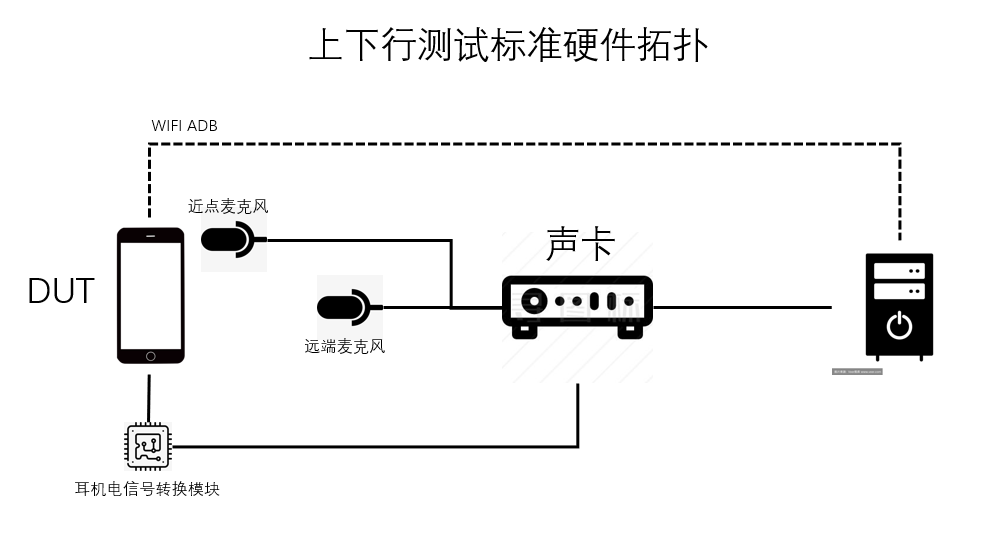
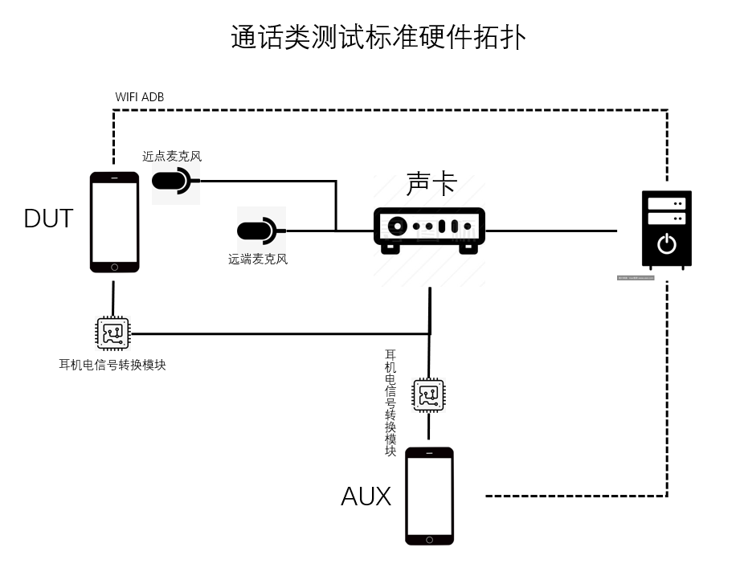

# 硬件场景搭建
由于部分保密无法呈现，目前阶段仅呈现拓扑图，实际设备

## 硬件场景拓扑图

### 标准场景拓扑搭建
如图，以下逐一解释各个器件用处：  
1.声卡使用标准声卡，如：瑞声1284/1384等声卡，或者使用AP设备。   
2.近点麦克风是采集整机听筒MIC信号内容，常用于通话/微信语音消息等场景。  
3.远端麦克风是采集整机响度较大的整体声音质量，常用于大部分场景。  
4.耳机电信号转换模块使用自制线缆，图片参考后面转接硬件拓扑图。  
5.电脑使用普通PC即可，不建议使用笔记本电脑，原因略。

<figure>
    
    <figcaption>图1:一般测试标准拓扑</figcaption>
</figure>

  

### 通话场景拓扑搭建
如图，大部分设备基本相同，针对不同设备以下特别说明  
1.加入AUX联动测试，达成通话上下行测试全自动  
2.声卡INPUT和OUTPUT口需要充足，建议8 INPUT口和4 OUTPUT 以上  
3.软件功能需要改造，要同时进行录制&播放  

<figure>
    
    <figcaption>图2:通话测试标准拓扑</figcaption>
</figure>

  

### 耳机电信号转换模块设计
如图，使用四段式耳机模块来呈现此模块设计方式，如果整机设备仅支持TypeC模拟或数字接口，可以自行购买成品转接线，TypeC数字耳机可以使用部分USB模拟hub进行模拟音频信号收发功能，比如说Megasig的U965盒子  

<figure>
    
    <figcaption>图3:转接模块</figcaption>
</figure>

