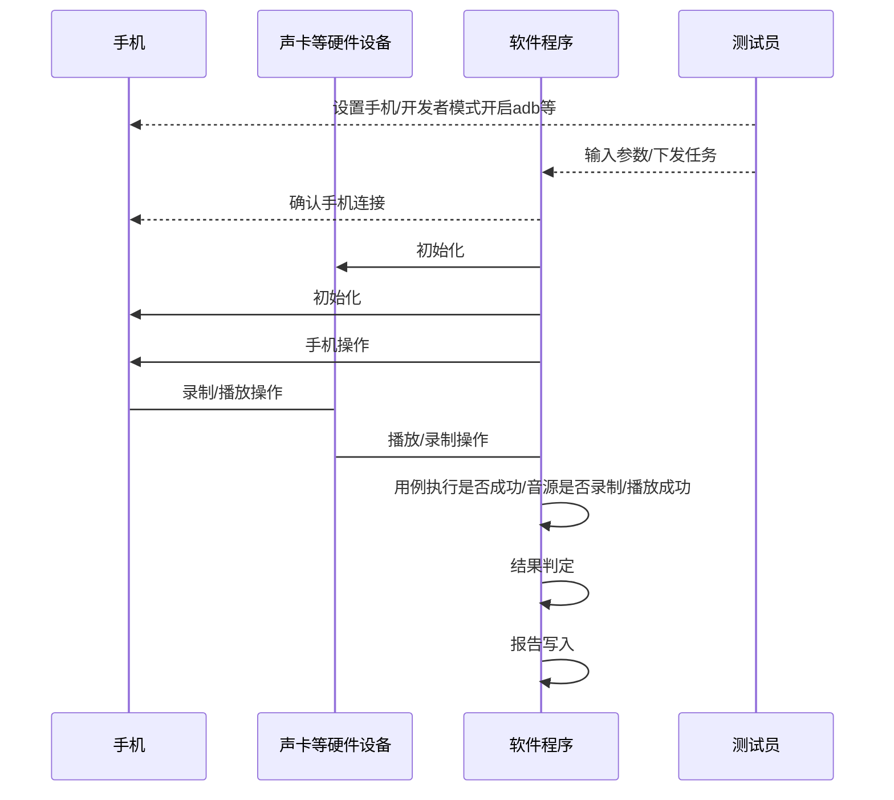
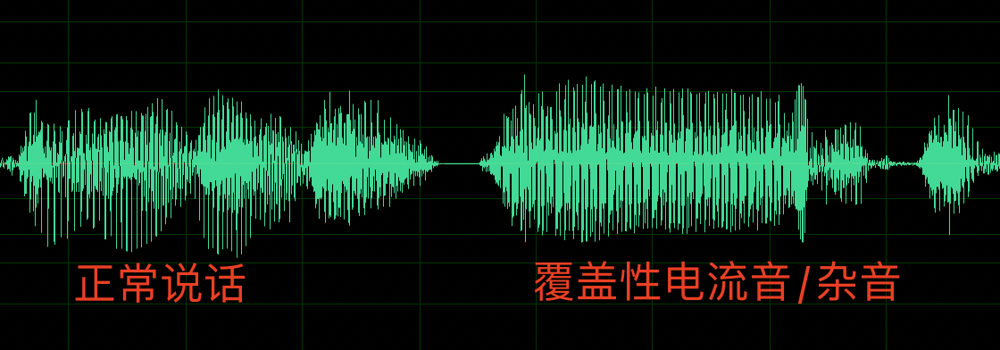
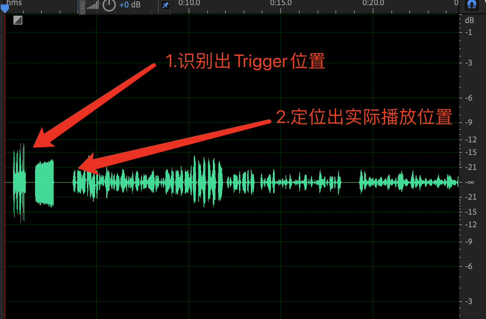
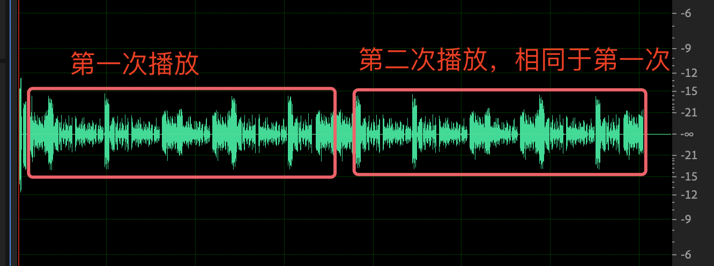
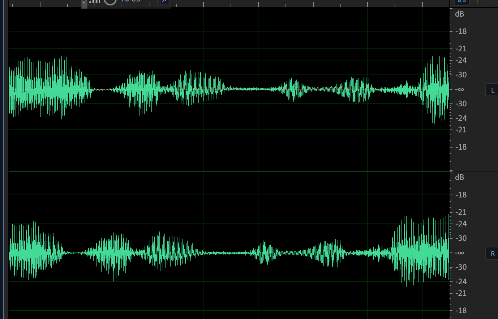
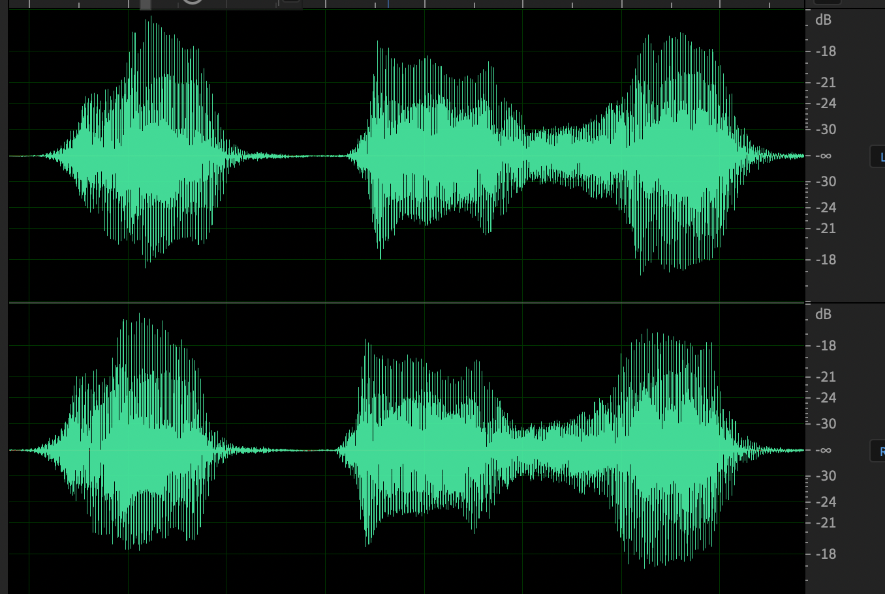
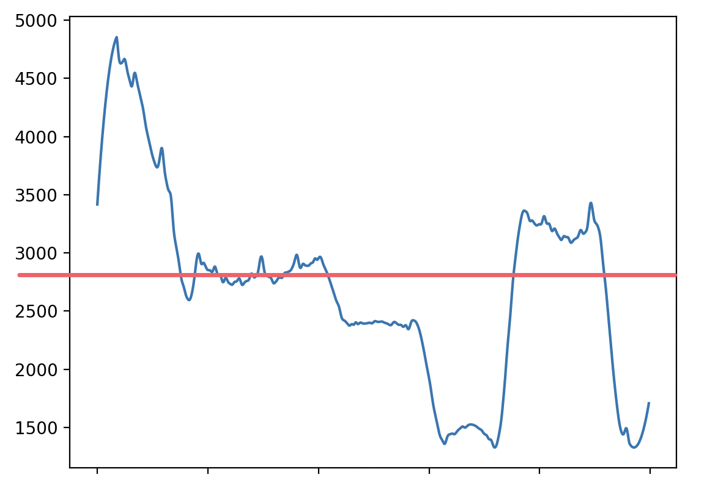

# AudioDealofOP
除常规业务项目外，其余技术方面比较深入的工作内容精炼总结，主要是自动化、硬件场景搭建、音频杂音识别相关内容。有必要提醒一下，由于html和Github支持的Latex语法问题，所以不单独修改语法，需要查阅请自行clone到本地  
有疑问请提issue  
- [x]基础知识
- [ ]硬件框架  
- [ ]整体拓扑
- [ ]软件框架
- [ ]算法逻辑
- [ ]算法关键代码

文档分块
- [音频测试卷积神经网络应用](CNN4AudioTesting.md)
- [音频测试场景硬件搭建](HARDWARE4AudioTesting.md)

# 基础
## 标准化

### 数字音频标准化:波形大小标准化、dBFS和与Audition对齐
1.soundfile库会把能读取的wav格式文件，波形数值范围自动标准化为-1—1范围，取名为$sample_{read}$，其中$sample_{read}\not=0$   
2.部分格式soundfile库无法读取，比如32bit的wav文件或者其他格式，读取可能为对应PCM值，需要自行换算为$\frac{sample}{depth_{intmax}}$，标准化为-1—1的范围   
3.针对波形和FFT对应的dBFS幅度计算方法：  
$$dBFS=20*\log_{10}(\frac{sample}{ Sample_{max}})，Sample_{max}为音频位深对应最大采样值$$
所以针对波形换算为dBFS幅度，使用直接映射计算：  
$$dBFS=20 * \log_{10}{sample_{read}}\space\space其中sample_{read}\neq0$$
若遇到sample点为0，自行映射到$-\infty$或其他低于该最小幅度值以外，比如16bit PCM文件，最小dBFS为$20*\log_{10}\frac{1}{int16_{MAX}}=-90.3dBFS$ ,聪明的读者会问：我得知的16bit PCM文件动态范围是96dBFS,为什么在你这却少了-6dB,因为那个计算方法是计算-32768~32767整个动态范围，而我说的公式只计算1~32767范围，而整个动态范围计算简洁明了：$20*\log_{10}(uint16_{max})=96dB$
上述能延申出几个知识点，比如：6dB相差一倍而非3dB，在此不做延申

所以针对FFT换算dBFS幅度，也可以直接按上述方式换算为dBFS,如果是自行使用的话，同样计算方式下dBFS对比值是有意义的，当然看绝对值没有意义，所以需要和Audition的频率分析工具内幅度对齐，那样其他小组或部门分析或整合的阈值可以直接套用到自身系统上  
如果直接对齐Audition，直接上代码，可以自行对比，若有错误此处不做阐述，请自行校验和修改
```python
from scipy import signal,fft
import numpy as np
def spectrum(data,fftSize,rate=48000,overlap=0.5):
    '''
    与audition对应频率分析图表
    ：param data：数据段
    ：param fftSize：分析fft大小，一般为512/1024/2048/4096/...等
    ：param rate：采样率，用于横坐标对齐
    ：param overlap：重叠率,一般为50%，可以自行选择
    '''
    dataSplit=[]
    window=signal.windows.hanning(fftSize)
    splitLinespace=range(0,len(data),int(fftSize*overlap))  #会漏掉最后一部分数据，但是不多，问题不大
    for i in splitLinespace:                                #
        if(i+fftSize)>len(data):
            break
        dataSplit.append(data[i:i+fftSize])
    fftSum=np.zeros(fftSize//2)
    for i in dataSplit:                                     #分区
        i=i*window                                          #加窗
        fftData=abs(fft.fft(i))                             #fft
        fftSum+=np.array(fftData[:fftSize//2])              #求和
    fftAvg=fftSum/len(dataSplit)                            #平均
    
    fftSpectrum=20*np.log10(abs(fftAvg)/(fftSize//4))       #幅度换算与校准
    fftFreq=np.linspace(0,rate//2,fftSize//2,endpoint=False)#横坐标计算
    return fftFreq,fftSpectrum                              #返回横坐标和纵坐标
```

#### 设备标准化(Audio Precition平替)：声卡&采集标准化/线材连接标准化/音源标准化
最好使用AP开发，如果没有AP，那就使用下面方案
需要拆解耳机识别原理/耳机CODEC MAX输入输出电压，熟悉分压原理  
自行咨询开发查阅耳机设计文档，定制专门的方案  
但是现在有取消模拟MIC趋势，数字MIC可以使用正经USB厂家设计USB音频采集盒，并且定制专门协议“伪装”不同耳机，激发手机内部不同输出策略，从而实现全场景测试  
序列图呈现交互模式如图所示：  



#### 声卡&采集标准化 
以下参考按照测试场景需求搭建，没有标准答案
声卡参考：瑞声新谱1284等
麦克风参考：Grass 46AM
线材参考：2k电阻 3.5mm - BNC 1.5V电源
  

有线耳机拓扑参考：共地;手机输出->声卡input;声卡output->2k电阻->手机麦克风
外放拓扑参考：人工耳，麦克风矩阵
蓝牙耳机拓扑参考：人工头

#### 线材连接标准化
线材参考：2k电阻 3.5mm - BNC 1.5V电源 
手机模拟耳机场景与声卡连接使用2k电阻，，声卡output->2k电阻->手机麦克风
数字耳机使用声卡output->1.5V电源->数字转接器麦克风 ，确保数字转接器麦克风端电压>声卡output

#### 音源标准化
  
时域频域都要有自己思考，各个场景都要定制。无法对准，时域对齐场景使用自相关函数对齐
音源时序上，除开特殊播放场景，使用以下格式：
| Trigger | 短时间二次校验音源 | 测试音源A | 测试音源B | 测试音源C |
|-------|-------|-------| -------|-------  |

Trigger用于定位实际播放时间和确定测试音源起波时间，如果是整段时间计算Trigger，则需要二次校验音源去确定Trigger的准确性，建议对音源Trigger计算范围进行限位，可以不用二次校验的方法  


### UI操作/ID调用与声卡录制标准
外放场景：前置准备->设备录制->手机播放->手机暂停->停止录制->复位->算法计算->报告输出  
录制场景：前置准备->手机录制->设备播放->设备停止->手机停止录制->复位->算法计算->报告输出  
通话场景：前置准备->建立通话-> 设备播放->设备录制->设备停止->复位->算法计算->报告输出  


### 完备的接口测试能力
以安卓系统音频测试为例，如果将调用分层，可以分为：通话（带ref输入输出）、录音（输入）、播放（输出）、耳返（不带ref输入输出）  
不建议使用uiautomator等自动化工具进行测试，维护投入很大，建议直接开发APP进行测试，可以并入类似产测工具内（若有）  
此处细分测试场景：  
- 测试场景
    - 通话
        - 实网通话（宽带/窄带/超宽）
        - VOIP（采样率8k、16k、32k、48k）
        - 卫星通话 
    - 录音（各采样率调用）
    - 播放（各采样率调用）
    - 耳返（根据业务需求定制）

实际上安卓系统测试应该以自带应用和top应用实际调用流程设计，所以上述场景所有调用除了本身系统支持的接口调用外，还需要做top应用调用覆盖。例如：  
1.抖音手持免提VOIP在调用上是使用VOIP通路，但是插入耳机后使用上录音/播放通路。已沟通，抖音答曰：高清音频  
2.微信实际会有回声/降噪等处理，需要提前测试其降噪能力和回声处理能力，以便和系统内置处理达成最优处理（整机系统只会copy大部分实网通话参数过voip处理，所以这里资源需求很高）  
3.部分游戏和软件调用会是大量Track写入，要注意甄别和看护自身性能模型/性能模式  
4.注意音频链路策略，可能会根据不同packageName分开不同Track处理  


# 进阶
## 设备录制与手机播放时间差校准
如上述，部分场景设备录制需要先于手机，部分场景手机录制先于设备播放，此场景有至少2s差异，如果遇到uiautomator断连情况，可能延长到20s甚至50s，因此需要做时间差校准  
差异如图所示:  
| *播放音源*|trigger| 二次校验| 测试音源|||
| ----- | :-----: | :-----: | :-----: |-|:-:|
|*录制音源*|提前录制导致的silence|trigger|二次校验|测试音源|防止漏录silence|

需要知道提前录制导致的silence时常是多少，才能抓取到有效音源位置，从而进行细致的音频分析，若不能知晓此时长，则只能对整体音频做整体响度判定


### 自相关函数（时域）（精度最高，误差25/48000 s内）
在测试音源中嵌入trigger音源，后使用trigger音源逐采样点计算自相关值，最大即为trigger位置，可以使用二次校验排除误差情况
trigger定制需要巧妙，时间要在降噪算法生效前尽可能长，尽可能寻找不被手机算法捕捉直接播放的特制音源
算法可见wavBaseFunc.delay函数  

```python  
from nump
def delay(data,trigger):
    '''
    定位data内，trigger波形的位置
    ：param data：数据段
    ：param trigger：trigger波形
    '''
    if(len(trigger)>=len(data)):
        return False
    matching=[]
    for i in range(len(data)-len(trigger)):
        matching.append(np.dot(data[i:i+len(trigger)],trigger))
    
    location=matching.index(max(matching))

    if(type(location)==type([])):
        Log("multi Trigger Location")
        return location[0] 
    return location
```
可以使用cuda优化长音源计算时间    
```python
import cuda
@cuda.jit
def delay(data,trigger,result):
    id=cuda.threadIdx.x+cuda.BlockIdx*cuda.blockDim.x
    gS=cuda.gridDim.x*cuda.blockDim.x
    for i in range(id,len(data)-len(tri),gS):
        temp=0
        for j in range(len(tri)):
            temp+=data[i+j]*tri[j]
        result[i]=temp          #或者不用cuda，使用signal.correlate也可以有这样的效果，运算速度也比python自身硬算快，而且auto模式会有特别运算方式，能让速度优化到极快，具体原理是转化到fft域计算
```

```python
#这里是使用pytorch加速计算的demo
import torchaudio
from matplotlib import pyplot
import torch
import torch.nn.functional as F
import time
start_time = time.time()  # 获取当前时间戳
# 执行待计时的代码块
print(torchaudio.__version__)
devices=torch.device("mps")#因为使用是mac，所以这里用的是mps，若为nvdia显卡，则为cuda
cpuDevice=torch.device("cpu")
# info=torchaudio.info("/Users/luyongyi/yongyi的文档/OPPO工作经验/AudioDealofOP/torch4audio/test1.mp3")
# print(info)
data,rate=torchaudio.load("/Users/luyongyi/yongyi的文档/OPPO工作经验/AudioDealofOP/testAudio/nvwa/移动5G通话免提4格音量.wav")
tri,triRate=torchaudio.load("/Users/luyongyi/yongyi的文档/OPPO工作经验/AudioDealofOP/testAudio/nvwa/依赖/trigger.wav")
triDeives=tri[0].view(1,1,-1).to(devices)
dataDeives=data[0].view(1,1,-1).to(devices)
output = F.conv1d(dataDeives, triDeives ,padding="valid",stride=1)
print(output.device)
print("Triiger所在采样点为：",torch.argmax(output))
end_time = time.time()  # 获取当前时间戳
elapsed_time = end_time - start_time  # 计算时间差
print("代码执行时间为：{:.6f}秒".format(elapsed_time))
```
由于你使用自相关，互相关函数一般是直接取最大值，所以对应的trigger音源应该有以下注意事项：  
1.trigger的整体RMS值应该尽可能大    
2.trigger整体时长应该在1s左右，尽可能小  
3.trigger的波形特征不能为单频音，波形特征应该明显    


### 频谱阈值（频域）（精度较差）
就是使用某单频或复频音做校准，但是时间误差稍大，1024的FFT SIZE根据自身场景定制阈值即可，阈值小可能误判，阈值大了误差会增大   
整体思路就是判定好某个阈值，单个频点或者多个频点符合阈值筛选范围的，再对这个时间范围和对应频点幅度做峰值检测，就能够识别出最匹配时间，但是前提是FFT SIZE要跟音源波形时间有一定对应关系，或者在峰值检测处，对峰值相等的波峰做居中选择，在此不做赘述，可以自行做实验。


# 外放实际处理例子
以下使用伪代码，确保代码干净整洁能够理解  
外放问题一般来说比较简单，因为相对来说外放使用DRC/【处理模块】/增益控制等模块相对来说要少一些，而且启用的模块内部逻辑也相对比较简单些
## 定性音频 1Khz分析
### THD
THD内容在此不赘述了，网上有很多解决方案，直接算比率就行，非常简单  
可以转换到频谱计算各频率比值，可以直接滤波计算能量比值

```python
#代码待定

```
### 杂音
1Khz等音频内识别杂音模式非常简单，因为预期内是特定单一频率和其谐波，所以在频谱上只要使用signal库内iirnotch函数生成尖锐滤波器，再通过滤波期把基波和谐波频点滤除，就剩余环境底噪杂音  
```python 
frequency=1000          #基波
times=8                 #要计算的谐波阶数
for i in np.linspace(frequency,frequency*times,times,dtype="int"):
        b, a = signal.iirnotch(i, Q, rate)
        data=signal.filtfilt(b,a,data)
```
所以当且仅当此时谐波能量和基波能量被去除后，此时应当是仅剩余环境底噪和设备底噪。杂音此时会直接体现在波形或者信号能量上，可以直接进行识别  
若担心有部分杂音或电流音频点和1khz及其谐波相同被上述操作处理掉，可以使用别的频率进行处理，比如700hz，1.3khz等
### 响度
任何计权里，1KHZ响度永远都是权重为1，可以直接换算，比如当前设备在94db标准音源录制下，文件RMS平均值为-30db，那么此时校准值是30+94=124db，后续计算只需要在确保麦克风频响曲线是平直的情况下，对录制音源做完计权滤波后，响度为RMS值+124db

### 左右耳同步
在耳机端包括有线耳机和蓝牙耳机，尤其是蓝牙耳机，非常看重左右耳同步率，因为在目前体系的蓝牙耳机协议下，仅有一个耳机是与手机产生“正式连接”，称之为主耳，另一个耳机是“监听/偷听”主耳和手机交互包，称之为副耳。此设计非常巧妙，但是也会引入同步问题    
同步问题有很多解决方案，比方说蓝牙协议里有解决整机和主耳的同步包，这个也能影响到副耳和主耳的同步，比分说业内一些自己的协议，但是本文在于论述如何测试此同步问题  
测试方法1：  
可以继续使用1Khz音源进行左右耳同步检验，在单频音测试场景下，同步问题产生的相位问题可以直接简化为左右耳音源延迟问题，这时候可以直接计算左右耳1khz波形各区域采样点间距，就可以算出延迟。但这种状态只能算出延迟波动状态，不能计算出大延迟，适合比较稳定的系统  
比如说在48k采样率下，1khz一个周期占48个采样点  
此时如果延迟恰好是N毫秒，无法识别出延迟情况  
若延迟是0-N毫秒波动，那么延迟情况就能够通过此测试识别出  
  
## 普通音频 

### 覆盖型持续性电流杂音
如题意思，部分器件或者算法失效后，会失去输入信号，会覆盖性输出规律电流声（复频信号）  
在播放音源没有单频/复频信号情况下  
简单分析，FFT后对峰值频率做统计即可，峰值稳定持续不变的就是电流声  
准确分析，FFT后计算前后帧互相关性，互相关性满足一定程度，互相关性高的帧满足一定数量就是此电流杂音，但是需要的经验要特别足
- 精准分析
    - 计算基因周期，利用基因周期特征判定是否为重复基音过长片段
        - 若是：则为持续播放卡顿/覆盖性电流音
        - 若否：存疑继续分析
    - 计算基因周期内包络特征，利用人体说话包络特征起伏
        - 若基因周期内包络起伏小，较为平直，杂音概率高
        - 否，基本无此问题，不排除有超短暂电流音播放，需要另做分析和bug级别判断
    
    - 如图一所示，此覆盖性杂音包含基音周期长和包络平直两个特征，非常符合用来做案例讲解
        - 若人声/器乐是此平直特征，那么一个平直的包络范围内肯定包含很多基音周期


<div align="center">
<figure>
    
    <figcaption>图1:正常说话和覆盖性电流音比对</figcaption>
</figure>
</div>

### 左右耳同步
测试方法（普通音频）：  
可以使用实际音频进行校验，在左声道使用分帧后，对右声道200ms内先进行响度归一化操作，再进行互校验，就能计算出整体的延迟情况和延迟偏差  
伪代码如下  
```python
import 必须要的库

dataLeft=sf.read("左声道")
dataRight=sf.read("右声道")

dataLeftSplit=分帧(dataLeft)

dataRightSplitHuge=分大区域帧(200ms相对于左声道)

for k,v in enumerate(dataLeftSplit):            #遍历每帧
    L,R=归一化响度（v,dataRightSplitHuge）          #响度归一化
    cor=signal.correlate(L,R,"Valid")           #计算互相关系数
    从cor中分析，取当前延迟情况                   #分析cor相关系数
```


# 通话实际处理例子
因为通话天生带有一定的延迟，并且这个延迟可能是会中途变化的  
通话的卡顿/无声/信道噪声等模块相对来说也是比较多些，所以通话这里要用到的处理技巧要多些  
通话部分处理是：1.丢帧带来的补包  2.运营商延迟波动  3.链路播放DRC较极端的处理     
1/2都可以使用互相关计算相关性直接做出处理，原因是：    
1.**补包**：分为填0和补帧，填0使用简单0点识别即可，就是一帧内有持续0的包，但实际上要注意静音段的关系，静音时信道噪声最长时间一般有3s是持续为0的，需要排除静音段下的误识别。补帧解决直接使用互相关即可，按照前后两次播放对应关系，相关系数少于一定程度，然后继续分帧和前帧率做比较，若后续分帧和前帧相关系数高，则判断为补包。但要因为有基因周期关系，所以在某些程度上，在一个基因周期内，前后帧自相关关系很高，互相关法能把问题抓出，但是容易高频误判为补帧  
2.**延迟波动**：即使使用了播放缓存，现在通话环境和电话线路直接占用固定时间帧（时分复用）不一样，手机到基站距离会有干扰，有干扰就有重传并且手机在实际场景会移动，VOIP通话同理。再者手机/耳机/软件厂商会有针对此情况的应对，部分策略也会导致播放延迟。    
前后两次播放，抽象成左右声道计算对应的同步时间，就能知道整段通话是有多少延迟波动。临界点会有抖动，自行消抖即可，可以使用低通滤波器。  
下面详细解释整个流程

<div align="center">
<figure>
    
    <figcaption>图1:定位方法展示</figcaption>
</figure>
</div>  
trigger定位出来后，后续音频位置肯定是已知的，因为设置的音频是两次相同的播放，所以通过对比可以知道此时的动态延迟  
<div align="center">
<figure>
    
    <figcaption>图2:前后两次播放</figcaption>
</figure>
</div>  
可以前后两音频转换成双通道左右声道音频，这样视觉对比情况会相对明显  

<div align="center">
<figure>
    
    <figcaption>图3:前后延迟差异大部分</figcaption>
</figure>
</div>  
   
     

<div align="center">
<figure>
    
    <figcaption>图4:前后延迟差异小部分</figcaption>
</figure>
</div>  

由上述两图可以看出,通话部分在不同时间通讯延迟会有区别，从而导致音频播放有延迟，如果业务需要抓取出通话延迟动态变化状况，可以使用分段互相关方式确认延迟情况  
<div align="center">
<figure>
    
    <figcaption>图5:延迟波动情况</figcaption>
</figure>
</div>     
红线为无延迟标准线，纵坐标为偏移量，单位是采样点。横坐标是时间。
  
整体处理代码如下，使用类C流程代码，易懂，请根据自身业务代码适配  

```python
import torchaudio
from matplotlib import pyplot as plt
import torch
import torch.nn.functional as F
import time


#读取音源

data,rate=torchaudio.load("torch4audio/移动5G通话免提9格音量_L.wav")
tri,triRate=torchaudio.load("torch4audio/trigger.wav")
refData,refRate=torchaudio.load("torch4audio/裁切整体通话音源ref.wav")
TRITIME=int(2.68*rate)
#此处定位Trigger位置

start_time = time.time()  # 获取当前时间戳
# 执行待计时的代码块
print(torchaudio.__version__)

#数据下沉到device，我这是mps
devices=torch.device("mps")
cpuDevice=torch.device("cpu")
# info=torchaudio.info("/Users/luyongyi/yongyi的文档/OPPO工作经验/AudioDealofOP/torch4audio/test1.mp3")
# print(info)
triDeives=tri[0].view(1,1,-1).to(devices)
dataDeives=data[0].view(1,1,-1).to(devices)
output = F.conv1d(dataDeives, triDeives ,padding="valid",stride=1)
triLocation=torch.argmax(output).item() #执行到此处会卡住，若不涉及读取，程序可以和gpu运算并行
print(output.device)
print("定位位置：",triLocation)
end_time = time.time()  # 获取当前时间戳
elapsed_time = end_time - start_time  # 计算时间差
print("trigger定位代码执行时间为：{:.6f}秒".format(elapsed_time))
#print(data[:,0:1])
#这里进行音频的裁切
print(len(refData[0]))
realDataPre=data[:,triLocation+TRITIME:triLocation+TRITIME+len(refData[0])//2]
realDataAft=data[:,triLocation+TRITIME+len(refData[0])//2:triLocation+TRITIME+len(refData[0])]
print("pre",realDataPre)
print("aft",realDataAft)
#print(len(realData))
#
# result = torch.cat((realDataPre, realDataAft), dim=0)#前后两声道合成为双声道文件便于保存观测整体偏移量以便核对
# print(result)

#torchaudio.save("torch4audio/cutsample.wav",result,refRate,format="wav")
start_time = time.time()  # 获取当前时间戳
#for循环进行conv1d计算，计算延迟
TIMECALCULATE=50        #前后计算多少ms，要有一个范围
GAP=int(TIMECALCULATE/1000*rate)   #前后计算量,计算多少个采样点
FFTSIZE_GAP=4800
setp=100            #计算间隔，类似stride，用于减少显存压力
ans=[]
print(len(realDataPre[0]))
for i in range(GAP,len(realDataPre[0])-GAP,setp):
    preData=realDataPre[:,i-GAP:i+FFTSIZE_GAP+GAP][0].view(1,1,-1).to(devices)
    refDatas=realDataAft[:,i:i+FFTSIZE_GAP][0].view(1,1,-1).to(devices)
    ans.append(F.conv1d(preData, refDatas ,padding="valid",stride=1))
print("计算任务已完全下发")
ansLocation=[]
for i in ans:
    ansLocation.append(torch.argmax(i).item())

print(ansLocation)
#根据对比值寻找偏移量，此处应该跟对比帧RMS值挂钩
import json
with open('data.json', 'w') as f:
    json.dump(ansLocation,f)
end_time = time.time()  # 获取当前时间戳
elapsed_time = end_time - start_time  # 计算时间差
print("核心延迟定位代码执行时间为：{:.6f}秒".format(elapsed_time))
# plt.plot(ansLocation)
# plt.show()

from scipy import signal

import numpy as np
from scipy.signal import savgol_filter
# 示例信号
# 应用移动平均平滑
b,a=signal.butter(4,0.005 ,"low")
filtansLocation=signal.filtfilt(b,a,ansLocation)
#自行匹配好横纵坐标,这里就不说明了
plt.plot(ansLocation)#平滑前的波形
y_smoothed = savgol_filter(filtansLocation, window_length=3500, polyorder=2)
plt.plot(y_smoothed)#平滑后的波形
plt.show()

#plot图形，输出plot图 

```

### 响度
同外放处理，通话响度可以参考K计权，使用A计权也可以


### 


