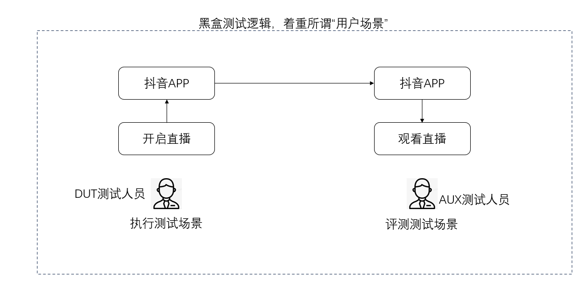
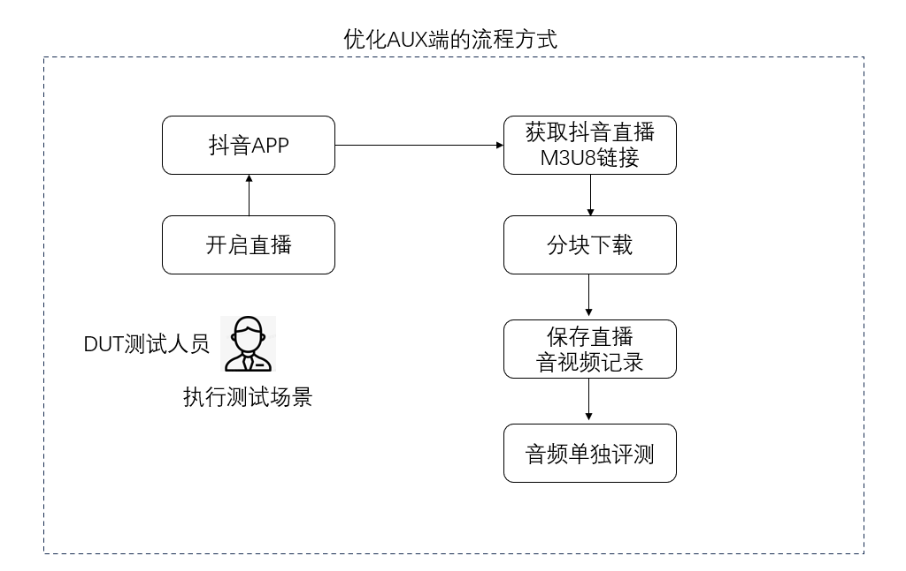
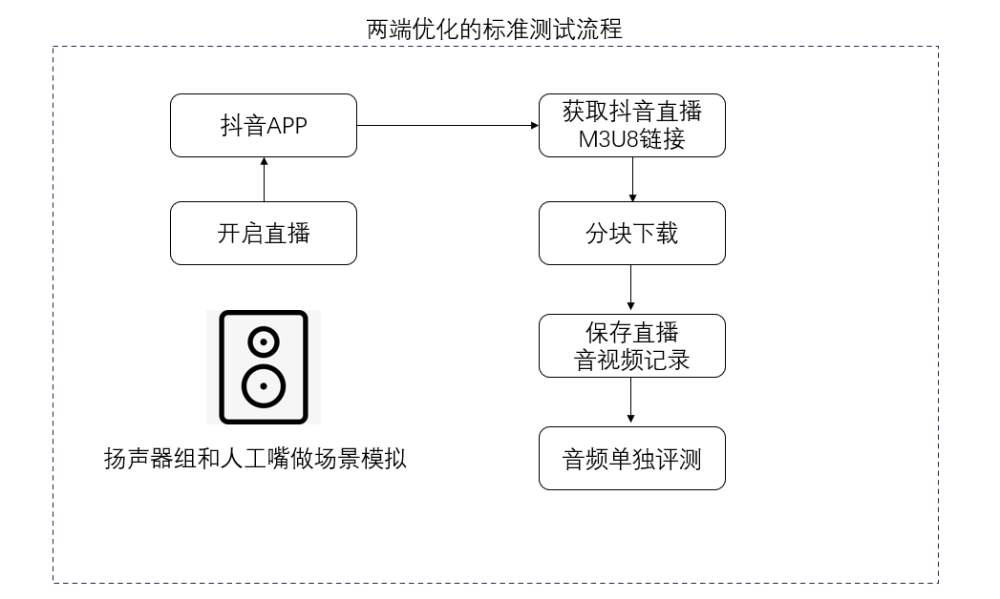
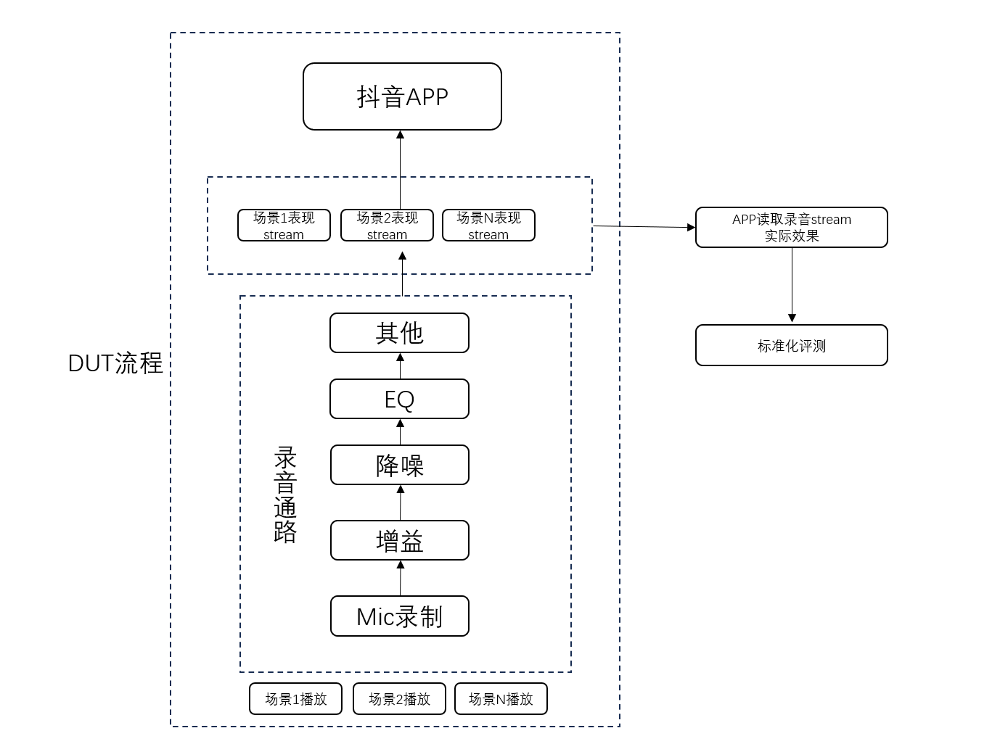
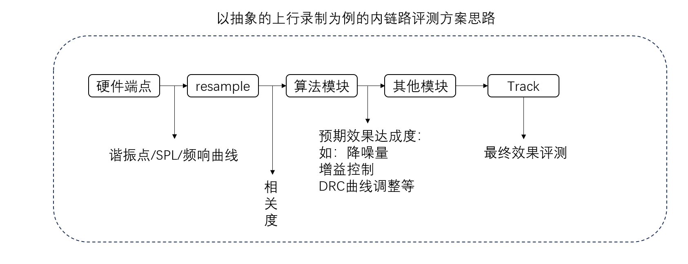

# 概述
大概讲述自己在以前工作中，对于高人力依赖的测试团队的测试方案优化思路

## 两人测试场景优化
一般是需要一个人做动作，另一个人实时评测的场景  ，两个人不能在同一环境下，也不能做单人优化的场景  
比如说直播，通话，微信电话等  
  
核心逻辑是DUT人力流程用扬声器替代，AUX端取消工位，使用技术手段采集  
但要注意这里一般会因为业务迭代有几个妥协点，不能一蹴而就  
1.仍然需要人力验证，不信任扬声器发声：可以只在AUX端使用技术手段采集，这样效果可以做留档多人评审，同时还可以和项目同步验证，不干扰旧流程正常进行。  
2.信任扬声器发声，但是异常没有能力用算法识别：DUT场景搭建使用人工，测试过程使用扬声器发声，AUX端使用人力评测  
3.信任扬声器，有能力做异常识别和场景评测：到这里核心逻辑才是是DUT人力流程用扬声器和UIControl替代，AUX端取消工位  
4.直接测试手机音频ID调用，取消和网络和三方软件的耦合  
### 直播/RTMP推流软件
以抖音直播测试为例  
如果以黑盒形式测试，只完成所谓用户场景测试任务，就会有以下测试方案：  

<figure>
    
    <figcaption>图1:黑盒测试思路</figcaption>
</figure>

  

优势 ：   
1.能够快速响应和完成场景搭建  
2.门槛简单，思路清晰，符合直觉  
劣势：  
1.测试用例写法繁琐复杂  
2.人员需要培训，无法立即上手
3.人力需求大，测试需要两人且占用两静音房
  
此时如果稍加优化，可以在原来基础上不反直觉的做AUX端优化，DUT测试员可以直接做完一整套场景，若组员短时间内不认可，也可以在原有测试基础上只做测试过程数据采集，如下图所示  

<figure>
    
    <figcaption>图2:保留测试方式下，AUX端优化思路</figcaption>
</figure>

   

如果组员认可，那就可以达成单人测试双端场景。若不认可，可以把音视频保存作为备用方案，方便以后测试回溯。  
优势：能够不干扰以前测试逻辑下做测试回溯且能单人做完两人场景测试   

如果再进一步，这里就可以直接对DUT要测试的场景做标准化拆分了，将DUT人力用喇叭组和人工嘴做模拟，如下图所示：

<figure>
    
    <figcaption>图3:DUT端人力替换</figcaption>
</figure>

  

此流程标准化后可以完全替代人力，架设好器具和设备后，手机操作使用UIautomator等库完成，喇叭和人工嘴操作使用正常控制声卡播放的库即可。简单来说有几个优劣：  
优势：  
1.能做场景标准化，可以固化测试输入，留存测试输出  
2.测试和评测时空分离，可以在A1时间点A2静音房完成的测试，在A3时间点A4机器上完成评测。  
3.可以对测试结果音频文件做技术性评测
4.节省测试人力  

劣势：  
1.如果设计UI自动化相关，测开投入大  
2.需要对场景标准化和用户场景有深刻理解  

如果测开能力足够支持，可以继续抽象测试方式，DUT端本身就是测试整个机器MIC端到抖音APP读入的Track流，可以使用一个仿抖音直播模块读取方式（在Log端行为调用一模一样，包括PackageName）  
如下图所示  

<figure>
    
    <figcaption>图4:拆解链路，仿APP形式测试</figcaption>
</figure>

  

这里的抖音APP实际是需要一个仿抖音PackageName的录制软件，模拟抖音自身的录制调用，抓取出此类调用的效果  
如果再进行细致管控，可以直接对Log内音频节点输出进行管控，包括tunning参数和中间节点效果都可以进行管控，相关思路如下：  

<figure>
    
    <figcaption>图5:抽象的内链路测试</figcaption>
</figure>

  

### 通话

### VOIP

### 会议（VOIP群聊形式，但又有所不同）